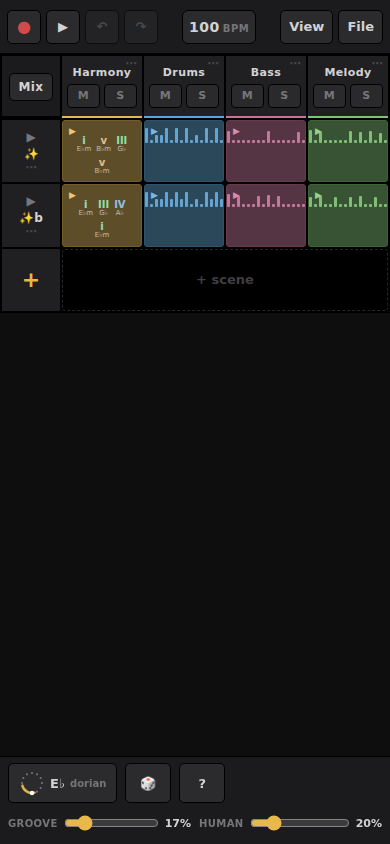

# Noodles

A phone-first music sketchpad for the browser that adapts Ableton Live's clip grid and launch-and-loop workflow to a touch screen. You build a song from short looping clips on four tracks (harmony, drums, bass and melody), and pitched notes snap to one global key and scale by default. A dice button rolls a new song, and measured gain trims on every sound preset keep the mix balanced from roll to roll. It is built with Vite, Tone.js and plain DOM and CSS, and installs as an offline web app.

**Status: working.** The project file format and the song model can still change between versions, and audio timing depends on the browser.

Live: https://ampactor.dev/noodles/



## Quick start

You need Node.js (CI uses version 20).

```bash
npm ci
npm run dev -- --host      # --host serves it on your LAN
```

Open the Network URL that Vite prints (it ends in `/noodles/`) on a phone on the same network. The app opens on a freshly rolled song: a grid of clips for the four tracks, with the tempo at the top and the key and scale in the footer. Tap ▶ to play. Browsers start audio only after a user gesture, so nothing sounds before the first tap.

### Judge speed on the production build

```bash
npm run build && npm run preview -- --host
```

The dev server ships unbundled ES modules and unminified Tone.js. On the target phone, a Galaxy A16 5G (an entry-level Android phone with a MediaTek Dimensity 6300), parsing that code costs more than anything else the app does, so dev-server timings mislead. The service worker that makes the app work offline also exists only in the production build, so test installing and offline use on `preview`.

## Usage

The main screen is a session grid. Each row is a scene (one clip per track, launched together) and each column is a track. The ? button in the footer opens a guide to the gestures.

- **Session.** Tap a scene's ▶ to launch the whole row on the next bar. Long-press a clip to set its launch mode (loop or one-shot) and its follow action (none, next, previous or random).
- **Arrangement.** The View button flips to a timeline over the same song. Clips can be moved, resized from an edge, split, duplicated, deleted and dragged across tracks, and a loop strip under the bar numbers marks a section. Arm record (●) and your scene launches and mute moves are written into the timeline bar by bar as you play.
- **Editors.** Tap a clip to edit it. Harmony uses a chord editor built on a playable circle of fifths under an engraved grand staff. Drums use a drum rack (a step sequencer with one row per drum voice). Bass and melody each use a scale-snapped piano roll with one-tap transforms: Arp, Oct− and Oct+, Humanize, 🎲 (random) and Clear. Every editor has a velocity lane.
- **Key and scale.** The key button in the footer opens the circle of fifths. Tap a wedge to hear its chord, or drag the rim to change key. Harmony is stored as scale degrees, so it follows a key change, and the bass and melody re-snap so nothing falls out of key.
- **Mixer.** Mix opens vertical strips with a fader, pan, reverb and echo sends, and live meters with peak hold. Tapping the Master strip opens four knobs for the master bus. Everything melodic ducks under the kick (sidechain ducking: each kick briefly turns the melodic tracks down).
- **Sound.** Tap a track name to open its device. The four preset names are the corners of an XY morph pad that blends between them. A color slot adds crush, phase, trem or wob (drums take crush only; saturation lives on the master bus), with amount and motion knobs and a per-track sound dice.
- **Drums.** Four sampled kits (street, warm, dusty and 808) play by default and morph on the same pad. `npm run samples` synthesizes their 24 one-shots offline into `public/samples/`. A per-voice picker also loads your own WAV files or records one from the microphone, and these stay on the device in IndexedDB. The synth kit remains as a second bank.
- **Dice.** The 🎲 button in the footer rerolls the key, scale, tempo, sounds and a starting scene at any time. Preset levels are matched by measurement (`npm run calibrate`), so a roll changes the flavor of the song without moving the balance of the mix.
- **Files.** File saves the project to a file or to local storage, imports a `.mid` file onto the four tracks, and exports WAV (the master and four stems) through the same signal chain you hear live. It also exports the chord line as a Staff PNG.
- **Undo.** Undo and redo work on snapshots of the whole session: song, mixer, devices and master.

`AGENTS.md` keeps the full list of what the app does, including the chop deck (a sampler source for the melody track), recorded motion lanes and the Groove and Human sliders.

## How it works

The app is five modules and a shell, each with one job:

- `src/model.js` holds the song as plain data along with the music theory: scales, chord spelling, voice leading and the dice. It has no DOM and no Tone.js.
- `src/audio.js` builds the audio graph and the transport. `buildGraph()` is the only place the signal chain exists: live playback and WAV export (an offline render) both call it, so an export sounds like what you heard. One `Tone.Loop` at 16th notes drives both scene looping and arrangement playback.
- `src/main.js` builds all of the UI with plain DOM calls and handles interaction. It reads engine state from `audio.js` and keeps no copy of its own.
- `src/circle.js` draws the circle of fifths on a canvas, as a view over the song's key and scale.
- `src/midi.js` imports MIDI files. It loads on demand.
- `index.html` is the shell and all of the CSS.

The design goal comes from `HANDOFF.md`: the controls carry the music theory. Chord names and scale degrees are one tap away, and the app has no lesson mode.

### Native audio nodes, with Tone.js for the clock

Crackle on a phone means the audio render thread missed its deadline: each 128-sample block (2.67 ms at 48 kHz) has to render in less time than it plays. Tone.js wrappers carry hidden nodes that cost render time even when silent, so the graph is built from native Web Audio nodes, and Tone.js keeps the transport, the clock and the parameters. A melodic note is an oscillator and an envelope made for that note and removed when it ends. `ROADMAP.md` records the result, measured with `npm run probe:render` on a desktop Xeon core: the cold open fell from 278 to 76-87 ms of render time per second.

### Why the web first

I chose the browser for the first version because the risk is in how the touch gestures feel, and the browser is the fastest place to iterate on them. The cost is Ableton Link (tempo sync between devices on a local network). A browser cannot join a Link session, so playing along with other gear in sync needs a native build later.

### Further reading

- [AGENTS.md](AGENTS.md): the app as built, the architecture in detail and the working conventions.
- [DECISIONS.md](DECISIONS.md): each design fork and the reasoning behind it (D1 to D32).
- [ROADMAP.md](ROADMAP.md): what shipped when, what is next and the on-device performance notes.
- [DESIGN-CIRCLE.md](DESIGN-CIRCLE.md) and [DESIGN-STAFF.md](DESIGN-STAFF.md): the circle of fifths and the engraved staff.
- [HANDOFF.md](HANDOFF.md) and [RESEARCH_FINDINGS.md](RESEARCH_FINDINGS.md): the original brief (audience and design principles) and the research behind it. The app later moved from that brief's first concept to the Ableton-style layout, and `AGENTS.md` wins where they disagree.

## Project layout

```
src/model.js      pure data and music theory, no DOM, no Tone.js
src/audio.js      the audio graph (native Web Audio nodes; Tone.js keeps the clock) and the transport
src/main.js       all UI and interaction
src/circle.js     the circle of fifths view
src/midi.js       the MIDI importer
index.html        the shell and all CSS
scripts/          headless test harnesses, probes and asset generators
public/samples/   the 24 generated drum one-shots
```

## Deploy

The GitHub Actions workflow in [.github/workflows/deploy.yml](.github/workflows/deploy.yml) runs on every push to `main`. It installs with `npm ci`, runs `npm run build` on Node 20 and publishes `dist/` to GitHub Pages, which serves it at https://ampactor.dev/noodles/ (Vite's `base` is `/noodles/`).

The build is a PWA (progressive web app: a site that installs to the home screen) made with `vite-plugin-pwa`. Its service worker precaches 36 files (1241 KiB in a build of this commit), including the drum samples, and the app makes no external requests, so an installed copy works with no network. A new deploy installs in the background. The app swaps to it on its own only before you have played a sound or made an edit; otherwise the ? page offers a restart and the next launch picks it up.

## Testing

There is no unit test suite, and CI only builds and deploys. The checks are headless-browser harnesses that you run by hand. They serve the production build, so build first:

```bash
npm run build
npm run smoke        # drives the core flow in headless Chrome and fails on any page error
npm run calibrate    # renders every preset through the real chain and prints RMS and peak tables
npm run audit        # measures the master chain against the constants in src/audio.js
npm run probe:render # times the audio render thread on seeded songs
npm run probe:music  # rolls 4000 songs through src/model.js and measures the notes (no browser)
```

The browser harnesses use `puppeteer-core` and look for Chrome at `/usr/bin/google-chrome`; set `CHROME_BIN` to use another binary.

- `smoke` launches scenes, opens the editors, records, exports and rolls the dice. It checks that the transport really advances (a lit play button is not enough), that one undo reverts a whole dice roll, and that no synth voices remain after a stop has rung out.
- `calibrate` is the ground truth for the preset gain trims in `src/audio.js`; run it before and after changing a preset or the chain. It takes about five minutes.
- `audit` starts with a self-test of its own meters, then measures gain, harmonics, loudness (LUFS) and true peak. It is the gate for any master-chain edit.
- `probe:render` and `probe:music` print evidence and assert nothing. Read them before and after a change.
- `npm run probe:vamp` rolls 600 songs and asserts the rules of one groove archetype (the vamp).

Nothing checks how it sounds or feels. Audio cannot be heard headlessly, so sound and timing are checked by playing the app on a phone.

## Limitations

Timing depends on the browser. Notes are scheduled from the browser's main thread with a quarter-second lookahead, and that thread has no real-time guarantee, so under heavy load or with the screen asleep the grid can drift in ways a native sequencer would not. No tests run in CI, so a sequencer regression can ship if nobody runs the harnesses by hand. Desktop browsers work, but the layout assumes a thumb on a phone screen.

- Audio behavior is verified by reading state in the harnesses and by ear on a phone, so treat timing as observed rather than guaranteed.
- Tempo sync with other devices (Ableton Link) is not possible from a browser.
- MIDI import folds every part onto the four tracks. An on-screen report lists anything the grid could not hold.

## Roadmap

`ROADMAP.md` lists named follow-ups that are not yet agreed. The next candidates:

- **MIDI export.** Import exists. Export is a named follow-up that the owner has not agreed to yet.
- **Rolled form.** The dice would set follow actions so that scenes play in a form (A, B, A) on their own. It is deferred because it changes the default session launch behavior, which is the owner's call.
- **A native build or Link bridge.** Needed for tempo sync with other gear. It waits until the touch interaction is settled in the browser.

## License

No license chosen yet.
